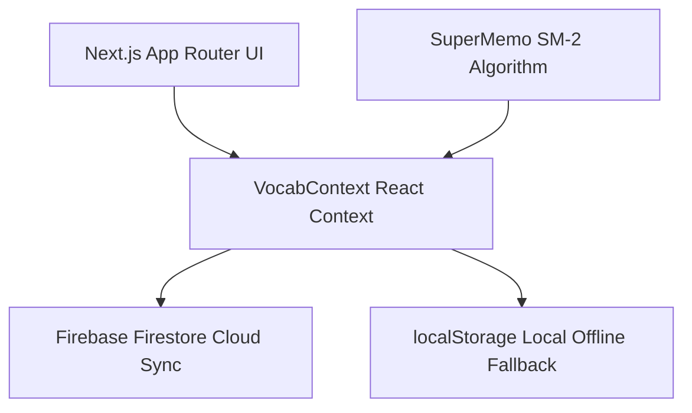

# LexiVault Architecture & Feature Documentation

Welcome to **LexiVault**, a modern, state-of-the-art vocabulary building and language learning application. This documentation outlines the codebase architecture, file structures, state management, key features, and visual components.

---

## Table of Contents
1. [Tech Stack & System Architecture](#1-tech-stack-sys-architecture)
2. [Directory Structure](#2-directory-structure)
3. [Global State & Database Synchronization](#3-global-state--database-sync)
4. [Core Features & Pages](#4-core-features--pages)
   - [Dashboard (Home)](#dashboard-home)
   - [Library Words](#library-words)
   - [Practice Arena](#practice-arena)
   - [Review Queue (SM-2 Spaced Repetition)](#review-queue-sm-2-spaced-repetition)
   - [Fill in the Blank Game](#fill-in-the-blank-game)
   - [Statistics Arena](#statistics-arena)
   - [Settings Dashboard](#settings-dashboard)
5. [UX/UI & Responsive Sizing Guidelines](#5-uxui--responsive-sizing-guidelines)

---

<a name="1-tech-stack-sys-architecture"></a>
## 1. Tech Stack & System Architecture

LexiVault is designed with performance, premium aesthetics, and responsive accessibility in mind.
- **Framework**: Next.js 16 (using App Router) with Turbopack compilation.
- **Styling**: Tailwind CSS & vanilla CSS. Implements a unified dark space aesthetic theme (gradients, glassmorphism backdrop filters, clean border lines, and subtle micro-animations).
- **Backend & Database**: Firebase Firestore for real-time cloud data synchronization, with local offline fallback using `localStorage`.
- **State Management**: React Context API (`VocabContext`) to share vocabulary database state globally across the application.
- **Spaced Repetition**: SuperMemo SM-2 algorithm to schedule card reviews based on user response accuracy.



---

<a name="2-directory-structure"></a>
## 2. Directory Structure

Here is a summary of the key files and directories:

```
enlish/
├── app/
│   ├── components/
│   │   └── AppShell.tsx         # Sidebar, Global Navigation, Search, Add/Edit Word Modal
│   ├── context/
│   │   └── VocabContext.tsx     # Global React Context, SM-2 Engine, Firebase Sync Logic
│   ├── fillblank/
│   │   └── page.tsx             # Interactive Spell-Checking Game with Enter key triggers
│   ├── library/
│   │   └── page.tsx             # Paginated Word Grid, Batch Filters, Practice Picker Modal
│   ├── practice/
│   │   └── page.tsx             # Flashcard Recall Training with Custom Non-Overlap Queues
│   ├── review/
│   │   └── page.tsx             # Spaced Repetition queue & Liquid-wave progress charts
│   ├── settings/
│   │   └── page.tsx             # Goals, Account, Local Data Controls, Font Sizing Preference
│   ├── statistics/
│   │   └── page.tsx             # Interactive vocabulary acquisition metrics & distributions
│   ├── globals.css              # Custom utility styles, animations, and dark mode variables
│   ├── layout.tsx               # Root wrapper with viewport definitions and fonts
│   └── page.tsx                 # Core Dashboard with statistics cards and activity logs
├── lib/
│   ├── firebase.ts              # Firebase initialization and credentials loader
│   └── helpers.ts               # Sound play functions, string formatting, and date helpers
├── next.config.ts               # Next.js configurations
├── tailwind.config.ts           # Typography, custom layout sizes, and dark colors
└── tsconfig.json                # TypeScript environment compiler configs
```

---

<a name="3-global-state--database-sync"></a>
## 3. Global State & Database Synchronization

### `VocabContext.tsx`
`VocabContext` is the heart of LexiVault. It performs several key roles:
1. **Cloud & Local Storage Merging**: Fetches vocabulary documents from Firestore under the collections `/vocabulary/[type]/items`. If Firestore fails or is offline, it falls back immediately to loading data cached in local storage, preventing blank pages.
2. **Duplication Guard**: When adding a new vocabulary item, the system checks whether the word exists in the current library. If it exists, a custom modal warning pop-up is shown asking the user whether to cancel, merge, or overwrite the existing word.
3. **Spaced Repetition Scheduler (SM-2)**: Calculates review intervals (`interval`), repetition counts (`reps`), and easiness factors (`efactor`) using the SuperMemo SM-2 formula:
   - Correct recall (`known = true`): Increases reps and increases or adjusts interval.
   - Forgotten/wrong recall (`known = false`): Resets reps to 0 and resets interval to 1 day.

---

<a name="4-core-features--pages"></a>
## 4. Core Features & Pages

### Dashboard (Home)
- **Activity Summary**: Displays total cards count, streak count, due reviews count, and daily progress compared against the user's custom daily goals.
- **Recent Activity Logs**: Renders a list of the latest added words with interactive tooltips and easy navigation.

### Library Words
- **Flexible Filters**: Batch query filter options by category (`Word`, `Phrase`, `Idiom`, `Native Daily Phrase`), difficulty (`Easy`, `Medium`, `Hard`), bookmarks, and query search string.
- **Card Interactive Details**: Smooth card flip animations to inspect US/UK phonetic pronunciations, Vietnamese translation, and example sentences.
- **Selection & Practice Mode**: Allows multi-selection of cards to trigger a targeted custom practice session instantly.

### Practice Arena
- **Flashcard Recalling**: Prompts cards with US/UK audio triggers. A click flips the card with a 3D transition animation to check details.
- **Overlap-free Cycle Selection**: Tracks practiced words in `localStorage`. The system prioritizes unpracticed items. If the unpracticed list size is smaller than the requested limit, it selects the remaining items from the beginning of the list, resetting the cycle.
- **Auto-wrap Formatting**: Ensures that long phrases or sentences wrap correctly (`break-words`) and are fully displayed on all devices without truncation.

### Review Queue
- **Schedule Overview**: Groups due items by calendar periods (Overdue, Due Today, Upcoming Tomorrow).
- **Liquid-Bubble Wave Indicator**: A visual fluid wave animation representing the current load of the review queue relative to the daily goal.

### Fill in the Blank Game
- **Active Gameplay**: Hides characters in letters while showing the English meaning and Vietnamese translation (shown by default).
- **Toggle hint box areas**: Clicking anywhere on the hint card blocks (rather than just small text links) toggles hint visibility.
- **Keyboard-only Workflow**: Pressing `Enter` in the text box submits and checks your spelling. Pressing `Enter` once the answer has been checked automatically jumps to the next word immediately.

### Statistics Arena
- **Detailed Metrics**: Distribution charts by categories, difficulty density, streak records, review schedules, and overall accuracy percentages.

### Settings Dashboard
- **Learning Goals**: Configure targeted daily word acquisition values.
- **Global Font Size Prefs**: Persists a custom card font size preference (`Small`, `Medium`, `Large`, `X-Large`) globally in localStorage, affecting cards inside the Library and Practice modules.

---

<a name="5-uxui--responsive-sizing-guidelines"></a>
## 5. UX/UI & Responsive Sizing Guidelines

To maintain visual excellence and consistency:
- **Spacing**: Use standard padding (`p-4`, `p-6`, `p-8`) to prevent crowded elements on small viewports.
- **Glassmorphism**: Combine translucent backgrounds (`bg-slate-900/60`, `backdrop-blur-md`) with thin border lines (`border-slate-800/80`) to produce clean, sleek dark-themed dashboards.
- **Typographic Clarity**: All card elements utilize relative text sizing and word wrapping (`break-words`) to avoid horizontal overflow on screens.
